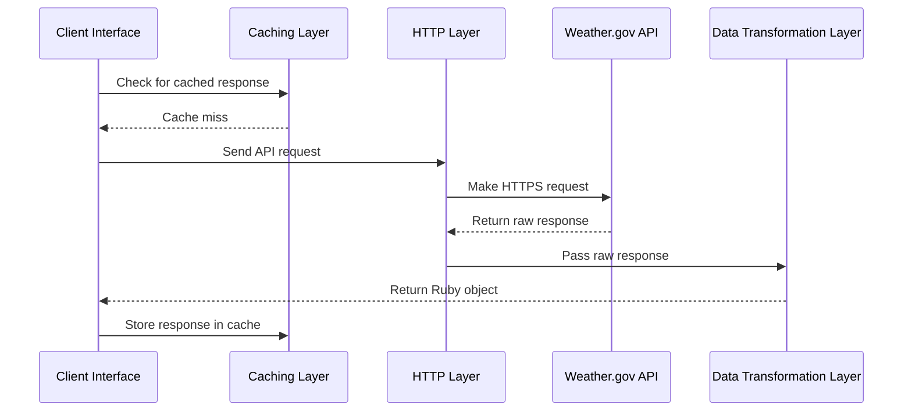

# Architecture Document (ARCHITECTURE.md)

## **Overview**

This document outlines the architecture for the WeatherGov Ruby Client, referencing the requirements defined in `docs/PRD.md`. The architecture is designed to meet the highest standards of quality, production-readiness, resilience, scalability, security, modularity, reusability, documentation, and testability. It provides a clear blueprint for building the system, ensuring alignment across all stakeholders.

---

## **High-Level Design**

### **1. Components**

The WeatherGov Ruby Client consists of the following key components:

1. **Client Interface**:
   - Provides a simple, intuitive API for interacting with weather.gov endpoints.
   - Supports methods for retrieving weather forecasts and alerts (Phase 1).
2. **HTTP Layer**:
   - Handles communication with the weather.gov API using the `Faraday` gem.
   - Enforces HTTPS and includes the required `User-Agent` header.
3. **Caching Layer**:
   - Implements memoization to minimize redundant API calls.
   - Caches responses for the lifetime of the client instance.
4. **Data Transformation Layer**:
   - Converts raw API responses into plain Ruby objects (POROs).
   - Ensures consistency with weather.gov API naming conventions.
5. **Error Handling**:
   - Categorizes errors into custom classes (e.g., `ClientError`, `ServerError`).
   - Logs detailed error information while exposing minimal details to the user.
6. **Logging**:
   - Provides structured logging with configurable log levels (`DEBUG`, `INFO`, `ERROR`).
   - Supports basic logging to file or stdout, with optional integration for external log aggregation tools.
   - Logs are structured in JSON format for easier parsing and analysis. Example log entry:

  ```json
  {
    "timestamp": "2025-05-03T12:00:00Z",
    "level": "ERROR",
    "message": "API request failed",
    "context": {
      "endpoint": "/points/39.7456,-97.0892",
      "status_code": 500,
      "response_body": "Internal Server Error"
    }
  }
  ```

<!-- markdownlint-disable-next-line MD029 -->
7. **Testing and Documentation**:
   - Includes 100% unit test coverage using RSpec.
   - Generates developer-friendly documentation using YARD.

---

### **2. Component Interactions**

#### **Request Flow**

The following sequence diagram illustrates the flow of data during a successful API request with caching:



## Data Flow

### Request Flow

1. The client interface receives a request (e.g., `get_forecast(latitude, longitude)`).
2. The HTTP layer checks the caching layer for a cached response.
3. If no cached response exists, the HTTP layer sends a request to the weather.gov API.
4. The API response is passed to the data transformation layer, which converts it into a Ruby object.
5. The transformed data is returned to the client interface and optionally cached.

### Error Flow

1. If the API request fails, the HTTP layer raises a custom error (e.g., `ClientError`, `ServerError`).
2. The error is logged with detailed information (e.g., HTTP status code, response body).
3. Minimal error details are exposed to the user.

#### Example Log Entry

```json
{
  "timestamp": "2025-05-03T12:00:00Z",
  "level": "ERROR",
  "message": "API request failed",
  "context": {
    "endpoint": "/points/39.7456,-97.0892",
    "status_code": 500,
    "response_body": "Internal Server Error"
  }
}
```

---

## Technology Choices

### 1. HTTP Layer

- **Gem:** Faraday  
- Lightweight and flexible HTTP client.  
- Supports middleware for adding headers and handling responses.

### 2. Caching

- **Mechanism:** Memoization  
- Simple and efficient for caching within the client instance's lifespan.  
- Does not persist beyond the client instance.

### 3. Logging

- **Library:** Ruby's built-in `Logger`  
- Provides basic logging functionality.  
- Supports configurable log levels (`DEBUG`, `INFO`, `ERROR`).  

**Optional Integration:**  
Allow users to configure external log aggregation tools (e.g., Logstash, Datadog) by exposing a custom logger interface.

### 4. Data Transformation

- **Approach:** Plain Ruby Objects (POROs)  
- Lightweight and dependency-free.  
- Mirrors the naming conventions of the weather.gov API.

#### Example Implementation

```ruby
class Forecast
  attr_reader :temperature, :humidity, :wind_speed

  def initialize(temperature:, humidity:, wind_speed:)
    @temperature = temperature
    @humidity = humidity
    @wind_speed = wind_speed
  end
end
```

### 5. Error Handling

#### Implementation

The following error class hierarchy is used to categorize and handle errors:

```ruby
module WeatherGovApi
  class Error < StandardError; end
  class ClientError < Error; end
  class ServerError < Error; end
  class NetworkError < Error; end
end
```

### 6. Testing

- **Framework:** RSpec  
  - Industry-standard testing framework for Ruby.  
  - Supports mocking and stubbing for API responses.  
- **Coverage Tool:** SimpleCov  
  - Ensures 100% unit test coverage.

### 7. Documentation

- **Tool:** YARD  
  - Generates developer-friendly documentation.  
  - Includes detailed descriptions of public methods, parameters, and return values.

---

## Deployment Strategy

### Packaging

- The client will be packaged as a Ruby Gem.  
- Semantic versioning will be used (e.g., `1.0.0` for the initial release).

### CI/CD Pipeline

#### Steps

1. Install dependencies.
2. Run unit tests with RSpec.
3. Measure test coverage with SimpleCov.
4. Lint code with RuboCop.
5. Generate YARD documentation.
6. Deploy the gem to RubyGems.org after passing all checks.

#### Tools

- CircleCI for continuous integration  
- SimpleCov for test coverage  
- RuboCop for linting  

---

## Key Architectural Decisions

### 1. Memoization for Caching

- **Reason:** Memoization is lightweight and sufficient for the client's lifespan.  
- **Trade-offs:** Does not support persistence or thread safety, but these are not required.

### 2. Plain Ruby Objects for Data Transformation

- **Reason:** Keeps the implementation lightweight and dependency-free.  
- **Trade-offs:** Requires manual validation and transformation logic.

### 3. Structured Logging

- **Reason:** Provides flexibility for debugging and integration with external tools.  
- **Trade-offs:** Requires users to configure external log aggregation if needed.

### 4. No Retry Logic

- **Reason:** Leaves error recovery to the application using the gem.  
- **Trade-offs:** Applications must handle retries for recoverable errors.

---

## Security Considerations

### HTTPS Enforcement

- All API requests must use HTTPS to ensure secure communication.

### Input Validation

- Validate all user inputs (e.g., latitude/longitude ranges) to prevent malformed requests.

### Dependency Management

- Use Dependabot to monitor and update dependencies for security vulnerabilities.  
- Lock dependencies using `Gemfile.lock` to ensure consistent builds.

### Logging

- Ensure logs do not contain sensitive information (e.g., API keys, user data).  
- Use structured logging for easier parsing and analysis.

### Threat Modeling

- Mitigate potential attack vectors, such as API abuse and denial-of-service attacks.  
- Follow OWASP guidelines for secure API integration.

---

## Scalability and Performance

- **Caching:** Reduces redundant API calls, minimizing latency and resource usage.  
- **Lightweight Design:** The client is designed to be efficient and avoid unnecessary overhead.  
- **Single-Threaded Use:** The architecture does not support multi-threading or multi-processing, simplifying implementation.

---

## Future Considerations

- **Additional Endpoints:** Expand support to all weather.gov API endpoints (e.g., observation stations, historical data).  
- **Enhanced Logging:** Add support for advanced logging features, such as correlation IDs for tracing requests.  
- **Asynchronous Support:** Consider adding asynchronous request handling for applications requiring concurrency.
